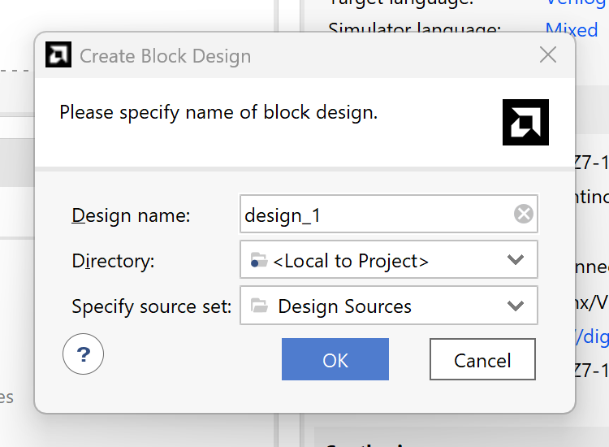
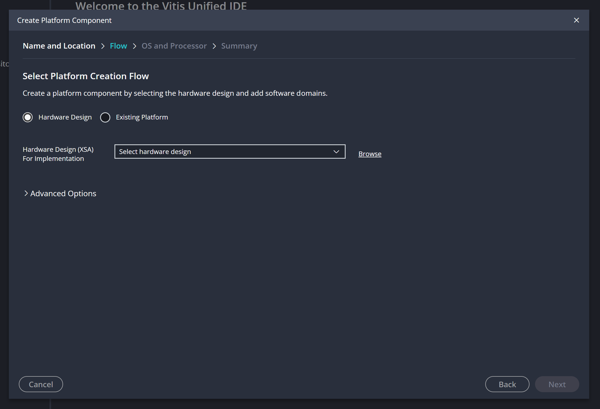
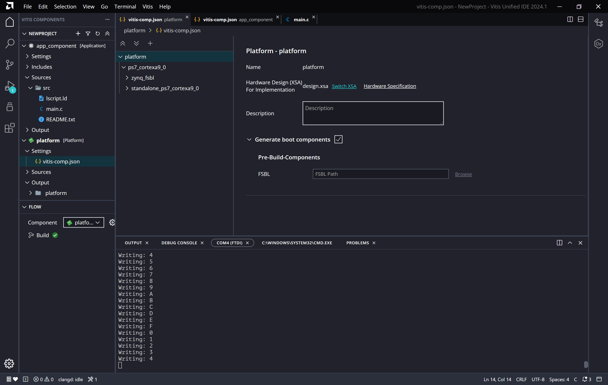

# Using Vivado and Vitis

## New Project Wizard

1. Click `Next >`.

    

2. Enter a project name and location. Click `Next >`.

    

3. Select RTL Project, ensure that `Project is an extensible Vitis Platform` is not selected. Click `Next >`.

    

4. Select the board that you are building for (this will allow you to use the preset GPIO packages). Click `Next >`.

    

5. Click `Finish`.

    

6. You should now see the Vivado GUI. Click `Create Block Design`.

    

7. Click `OK`.

    

8. Click `+`.

    

9. Search for `ZYNQ` and double click on `ZYNQ7 Processing System`.

    

10. Click `+` again and search for `AXI GPIO`. Double click on `AXI GPIO`.

    

11. Right click on the AXI GPIO block and click `Customize Block`.

    

12. Select `leds 4bits` from the drop down menu. Click `OK`.

    

13. Click `Run Block Automation`.

    

14. Click `OK`.

    

15. Click `Run Connection Automation`. Select `GPIO` and `S_AXI` and click `OK`.

    

16. Your block design should now look like this.

    

17. Click `Generate Block Design`.

    

18. Select `Global` and click `Generate`.

    

19. It is worth noting that you will see some warnings. These can be ignored. Click `OK`.

    

20. Back in project manager, right click on `design_1` and click `Create HDL Wrapper`.

    

21. Click `OK`.

    

22. Click `Run Linter`.

23. Click `Run Synthesis`. Then click `OK`.

    

24. Select `Run Implementation` and click `OK`.

    

25. Click `OK`.

    

26. Select `Generate Bitstream` and click `OK`.

    

27. Click `OK`.

    

28. Click `File` -> `Export` -> `Export Hardware`.

    

29. Click `Next >`.

    

30. Click `Include Bitstream` and click `Next >`.

    

31. Enter a name. Click `Next >`.

    

32. Click `Finish`.

    

33. Launch Vitis. Click `File` -> `New Component` -> `Platform`.

    

34. Click `Next`.

    

35. Click `Browse`.

    

36. Navigate to the directory where you exported the hardware. Click `Next`.

    

37. It will load for a minute.

    

38. Click `Next`.

    

39. Click `Finish`.

    

40. Click `Build`.

    

41. Click `File` -> `New Component` -> `Application`.

    

42. Click `Next`.

    

43. Select your platform component. Click `Next`.

    

44. Click `Next`.

    

45. Click `Finish`.

    

46. Create a new file called `main.c`.

    

47. Copy and paste the following code into `main.c`.

    ```c
    #include "xparameters.h"
    #include "sleep.h"
    #include "xil_printf.h"
    #include "xil_types.h"
    #include "xgpio.h"
    #include "xstatus.h"
    #include <xil_io.h>

    // Get device IDs from xparameters.h
    #define LEDS_BASE_ADDRESS XPAR_AXI_GPIO_0_BASEADDR
    #define LEDS_MASK 0b1111

    int main() {
        u32 leds;

        xil_printf("Entered function main\r\n");
        
        leds = 0;
        while (1) {
            sleep(1);
            leds++;
            xil_printf("Writing: %x\r\n", leds & LEDS_MASK);
            Xil_Out32(LEDS_BASE_ADDRESS, leds & LEDS_MASK);
        }
    }
    ```

    

48. Click `Build`.

    

49. Set the board jumpers to enable host and boot from JTAG. Connect the board to your computer.

    

50. Click `Run`.

    

    Now the LEDs on the board should be counting up in binary. You will notice that even though we are logging data in the code, nothing is printed in the debug console (who knows why?), to see the logs, use the serial monitor. Press `F1` and search for `Serial Monitor`, then select the port and use `115200` as the baud rate.

51. Now go back to the block design and add an AXI GPIO for the buttons.

    

52. Click `Generate Block Design` again.

53. Click `Generate Bitstream` again.

54. Export the hardware again (you can overwrite the previous .xsa file).

55. In Vitis, update the platform. Open `vitis-comp.json` and click `Switch XSA`. Select your new .xsa file.

    

56. Click `Build` in the platform component.

57. Update the application component `main.c` file. Click `Build`. Click `Run`.

```c
#include "xparameters.h"
#include "sleep.h"
#include "xil_printf.h"
#include "xil_types.h"
#include "xgpio.h"
#include "xstatus.h"
#include <xil_io.h>

// Get device IDs from xparameters.h
#define LEDS_BASE_ADDRESS XPAR_AXI_GPIO_0_BASEADDR
#define LEDS_MASK 0b1111
#define BTNS_BASE_ADDRESS XPAR_AXI_GPIO_1_BASEADDR
 
int main() {
	u32 leds;
    u32 btns;
 
	xil_printf("Entered function main\r\n");
    
    leds = 0;
	while (1) {
        sleep(1);

        btns = Xil_In32(BTNS_BASE_ADDRESS);
        xil_printf("Reading: %x\r\n", btns);

        leds++;
        xil_printf("Writing: %x\r\n", leds & LEDS_MASK);
        Xil_Out32(LEDS_BASE_ADDRESS, leds & LEDS_MASK);
	}
}
```
